# Crypto Trading AI Agent — How It Works

*Explained for everyone*

---

## Overview

This app lets you **trade cryptocurrency using natural language**. Instead of clicking buttons on an exchange, you just tell the AI what you want in plain English — like texting a friend who happens to be a trading expert.

| Step | What happens |
|------|-------------|
| **1. You chat** | Type a message like "Buy $100 of Bitcoin" or "What's the price of ETH?" |
| **2. AI understands** | The AI agent figures out what you want and picks the right tool (check price, buy crypto, check balance, etc.) |
| **3. Real data, simulated trades** | Prices come from a real exchange (Kraken in production, Binance locally), but trades happen in a simulated wallet (no real money). You start with $10,000. |
| **4. See results** | The AI replies in plain English. Your wallet and transaction history update automatically. |

---

## System Architecture

The flowchart below shows how data flows through the entire system. Follow the arrows from top to bottom — your message travels through each layer, and the response comes back the same way.

```mermaid
flowchart TD
  User(["🧑 You — Browser"])

  subgraph frontend ["🖥️ Frontend — Vercel"]
    UI["React App\nChat · Wallet · Transactions"]
  end

  subgraph backend ["⚙️ Backend — Render"]
    API["FastAPI Server"]
    Agent["AI Agent\n(LangChain + Gemini 2.5 Flash)"]
    Tools["Agent Tools\nPrice · OrderBook · Buy · Balance · History"]
  end

  subgraph market ["📊 Market Data"]
    CCXT["MCP Client\n(CCXT Library)"]
    Exchange[("Crypto Exchange\nKraken / Binance")]
  end

  subgraph storage ["💾 Storage"]
    DB[("MongoDB Atlas\nWallet & Transactions")]
  end

  %% Request path (solid arrows)
  User -->|"Type a message"| UI
  UI -->|"POST /chat"| API
  API -->|"Pass to agent"| Agent
  Agent -->|"Pick the right tool"| Tools
  Tools -->|"Need market data?"| CCXT
  CCXT -->|"Fetch live prices"| Exchange
  Tools -->|"Need wallet data?"| DB

  %% Response path (dotted arrows)
  Exchange -.->|"Price data"| CCXT
  CCXT -.->|"Return data"| Tools
  DB -.->|"Balance / history"| Tools
  Tools -.->|"Tool result"| Agent
  Agent -.->|"Natural language reply"| API
  API -.->|"JSON response"| UI
  UI -.->|"Show answer"| User

  %% Styling
  style User fill:#E3F2FD,stroke:#1976D2,stroke-width:2px,color:#000
  style UI fill:#C8E6C9,stroke:#388E3C,stroke-width:1.5px,color:#000
  style API fill:#FFE0B2,stroke:#F57C00,stroke-width:1.5px,color:#000
  style Agent fill:#E1BEE7,stroke:#7B1FA2,stroke-width:1.5px,color:#000
  style Tools fill:#FFF9C4,stroke:#F9A825,stroke-width:1.5px,color:#000
  style CCXT fill:#B2EBF2,stroke:#0097A7,stroke-width:1.5px,color:#000
  style Exchange fill:#FFF9C4,stroke:#F57F17,stroke-width:1.5px,color:#000
  style DB fill:#F8BBD0,stroke:#C2185B,stroke-width:1.5px,color:#000
  style frontend fill:#f0faf0,stroke:#388E3C,stroke-dasharray:5 5
  style backend fill:#fff8f0,stroke:#F57C00,stroke-dasharray:5 5
  style market fill:#f0fafa,stroke:#0097A7,stroke-dasharray:5 5
  style storage fill:#fdf0f5,stroke:#C2185B,stroke-dasharray:5 5
```

> **Solid arrows** = request path (your message going in) · **Dotted arrows** = response path (answer coming back)
>
> Left side handles *market data* (prices from the exchange) · Right side handles *user data* (wallet from MongoDB)

| Component | Description |
|-----------|-------------|
| **Frontend** | React app running in your browser (hosted on Vercel). Handles the chat UI, wallet display, and transaction history. Communicates with the backend via REST API calls. |
| **Backend + AI Agent** | Python FastAPI server (hosted on Render) with a LangChain agent powered by Gemini 2.5 Flash. The agent interprets your natural language and decides which tool to call. |
| **MCP Client (CCXT)** | A wrapper around the CCXT library that connects to the exchange. The exchange is configurable — Kraken in production (US-friendly), Binance locally (Asia). No API key needed for public price data. |
| **MongoDB Atlas** | Cloud database (free M0 tier) that persists your simulated wallet balance and transaction history across sessions. |

---

## What Happens When You Chat

The sequence diagram below reads top-to-bottom like a timeline. Solid arrows are requests; dashed arrows are responses.

**Key takeaway:** The AI agent acts as a smart router. It reads your message, understands the intent, picks the right tool, and translates the raw data into a human-friendly response. You never need to know which API to call — the agent handles it.

**Step by step:**

1. You type your question in the chat box and hit send.
2. The React frontend sends a *POST /chat* request to the FastAPI backend.
3. The AI agent (LangChain) passes your message to the Gemini LLM to understand intent.
4. The LLM determines it needs price data and calls the *get_crypto_price* tool.
5. The tool uses the CCXT library to query the exchange's public API for BTC/USDT.
6. The exchange returns real-time market data (price, bid, ask, volume, 24h high/low).
7. The LLM formats a natural-language reply and sends it back through the chain.
8. The frontend displays the answer in the chat — the whole round trip takes 3–8 seconds.

---

## What Happens When You Buy Crypto

This sequence diagram shows a more complex flow with **two external services** (exchange + database). The Buy Tool acts as an orchestrator — it coordinates between the exchange for pricing and MongoDB for wallet updates, all within a single tool call.

**Key takeaway:** The buy operation is *atomic* — the tool checks your balance, fetches the price, updates the wallet, and records the transaction all in one step. If any step fails (e.g. insufficient funds), the whole operation is rolled back and the agent reports the error.

**Step by step:**

1. The AI recognizes you want to buy and calls the *buy_crypto* tool with symbol and USD amount.
2. The tool fetches the current ETH price from the exchange (e.g. $1,972.25).
3. It calculates how much ETH $100 buys: 100 ÷ 1972.25 = 0.05070 ETH.
4. Your MongoDB wallet is updated: $100 deducted from USD, 0.05070 ETH added.
5. A transaction record is saved with price, amount, USD value, and timestamp.
6. The AI confirms the trade in plain English with a breakdown of the purchase.
7. Your Wallet and Transactions pages refresh automatically via Redux state updates.

---

## The AI Agent's Toolbox

The AI agent has 5 tools it can use. Based on what you say, it automatically picks the right one (or multiple). Think of them like apps on a phone — the AI opens the right app for the job.

| Tool | Description |
|------|-------------|
| **Get Crypto Price** | Fetches the real-time price of any cryptocurrency from the exchange (Kraken in production, Binance locally). Ask "What is the price of BTC?" and this tool gets the live data. |
| **Get Order Book** | Shows the current buy and sell orders on the exchange. Useful for understanding market depth and liquidity. |
| **Buy Crypto** | Simulates buying cryptocurrency with your USD balance. It fetches the real price, calculates the amount, and updates your wallet. |
| **Check Balance** | Returns your current wallet holdings with USD values. Shows how much of each crypto you own and what it is worth. |
| **Transaction History** | Lists your recent trades including type (buy/sell), amount, price, and timestamp. |

---

## Deployment Architecture

The entire stack runs on **free-tier services** ($0/month). The frontend is a static build on Vercel, and the backend runs as a web service on Render.

**Why Kraken instead of Binance?** The backend runs on Render's servers in Oregon, USA. Binance blocks API requests from US IP addresses, so the production deployment uses Kraken (which has no geo-restrictions). Locally, you can still use Binance if you're outside the US. The exchange is configurable via the `DEFAULT_EXCHANGE` environment variable.

| Service | Details |
|---------|---------|
| **Vercel (Free)** | Hosts the React static build. Auto-deploys on git push. Global CDN for fast loading. |
| **Render (Free)** | Runs the FastAPI backend. Sleeps after 15 min of inactivity; first request after sleep takes ~30–50s. |
| **Kraken API** | Public market data with no geo-restrictions. No API key required for price queries. |
| **MongoDB Atlas M0** | Free cloud database (512 MB). Stores wallet balances and transaction history. |

---

## Normal Bitcoin Buying vs This App

| Aspect | Normal Bitcoin Buying | This App (AI Agent) |
|--------|----------------------|---------------------|
| **How you interact** | Log into an exchange (Binance, Coinbase, etc.), navigate menus, click Buy, enter amount and price | Type in plain English: "Buy $100 of Bitcoin" |
| **Understanding needed** | You must know where to click and what each field means | AI understands natural language — no training needed |
| **Price lookup** | You check the price yourself on the exchange | AI fetches real-time price automatically |
| **Execution** | You confirm the order; real money is spent | AI simulates the trade; no real money (demo wallet with $10k) |
| **Wallet & history** | Stored on the exchange's servers; you need to log in to see them | Stored in MongoDB; visible in the app's Wallet and Transactions pages |
| **Best for** | Actual investing with real funds | Learning, testing strategies, or trying crypto without risk |

**In short:** Normal buying = you do everything manually on an exchange. This app = you chat, the AI does the work, and everything is simulated so you can learn safely.

---

## Tech Stack

| Layer | Technology |
|-------|-----------|
| Frontend | React, TypeScript, Redux Toolkit, Vite |
| Backend | Python, FastAPI, LangChain |
| AI Model | Gemini 2.5 Flash (via HKBU GenAI API) |
| Market Data | CCXT → Kraken (prod) / Binance (local) |
| Database | MongoDB Atlas (cloud, free M0 tier) |
| Hosting | Vercel (frontend) + Render (backend) — $0/month |
